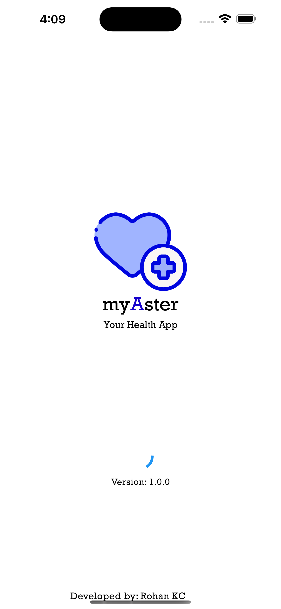
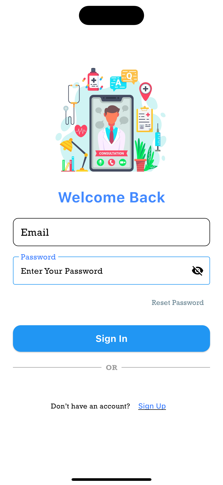
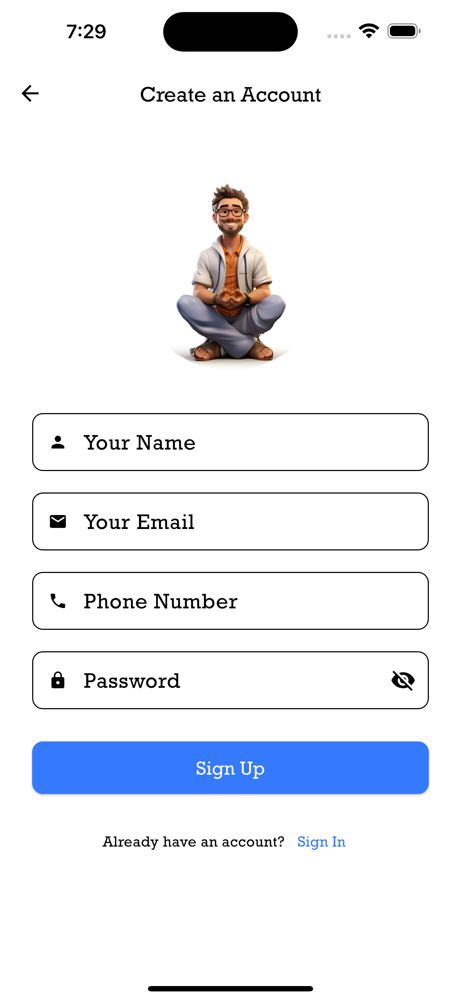
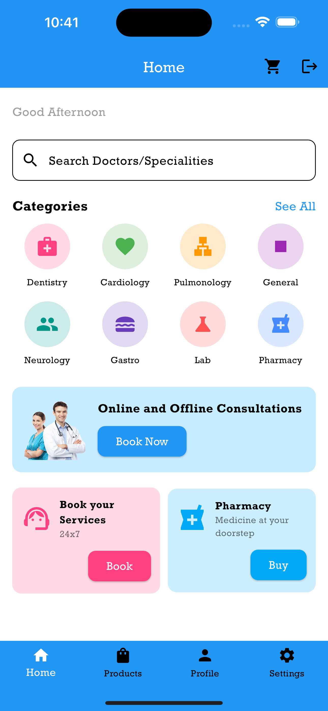
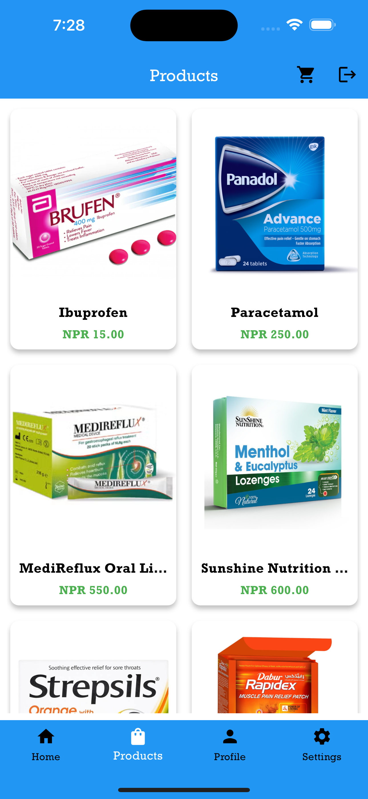
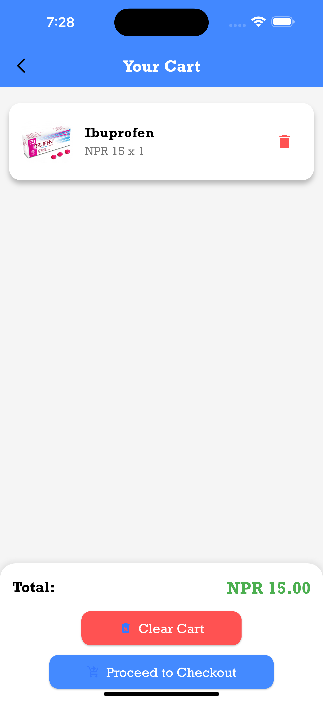
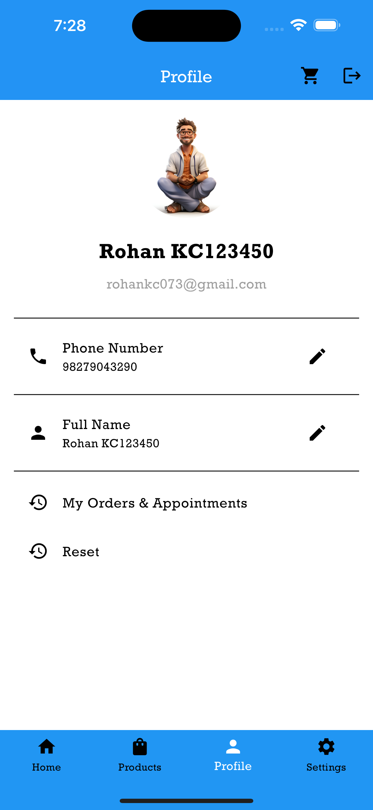
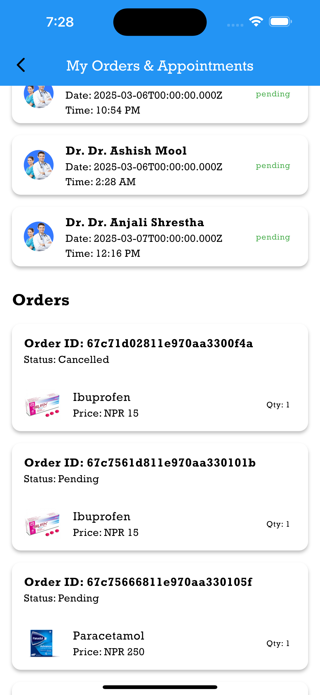

# 🏥 **Hospital Management & E-Pharmacy App** 💊 - myAster

This project is a mobile application designed to streamline hospital management and provide an e-pharmacy service. Developed using **Flutter** for the front end, **Node.js** for the backend, and **MongoDB** for the database, this app aims to improve healthcare services in Nepal. It allows hospitals to manage patient records, schedule appointments, and track inventory efficiently. Patients can book appointments online, view their medical history, and order medicines from an integrated e-pharmacy platform, all from one convenient app.

### Key Features
- 📝 **Patient Record Management**
- 📅 **Appointment Scheduling**
- 💊 **E-Pharmacy for Medicine Ordering**
- 🏥 **Hospital Inventory Management**
- 📲 **User-Friendly Interface**

  
  
  

  
  
  

  
  
  

  
  
  

